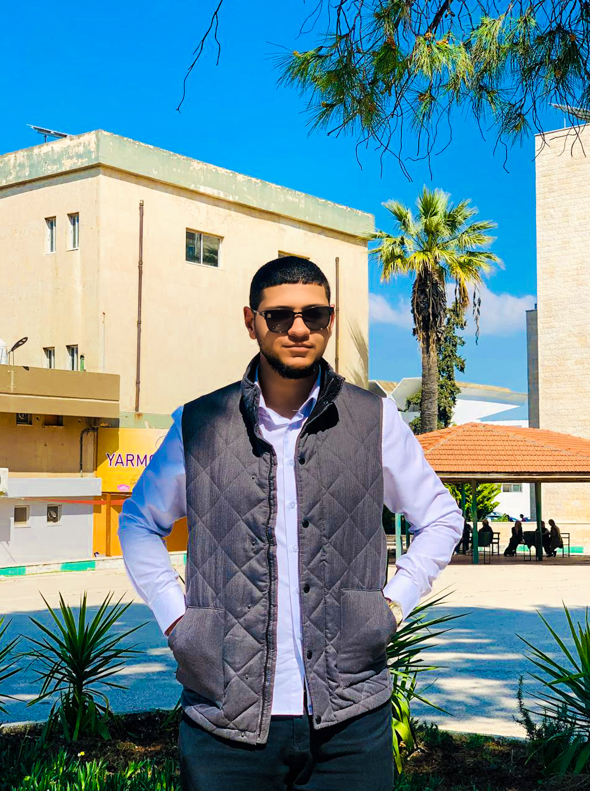

<html lang="en">
<head>
    <meta charset="UTF-8">
    <meta name="viewport" content="width=device-width, initial-scale=1.0">
    <title>Oday Hmydat - CV</title>
    
</head>
<body>

    <h1>Oday Hmydat</h1>
    

        
        

            
<strong>Email:</strong> odyhmydat@gmail.com

            
<strong>Phone:</strong> +962 780545668

            
<strong>Location:</strong> Koura District, Irbid, Jordan

        

    

    

        <h2>Education</h2>
        
A student from the third cohort of Cybersecurity at Yarmouk University, expected to graduate in 2025.

    

    

        <h2>Experience</h2>
        
I worked as a Data Entry Assistant at Computer and Information Center at Yarmouk University, and as a Problem Analyst at the Computer Centre. I assisted students with issues like incorrect passwords and emails, and helped them with external courses like Cisco courses.

    

    

        <h2>Skills</h2>
        <ul>
            <li>Proficient in Microsoft Office, data analysis, and IT troubleshooting.</li>
        </ul>
    

    

        <h2>Achievements</h2>
        
I contributed to improving the data management system by 20% through implementing updates and new technologies.

    

</body>
</html>
